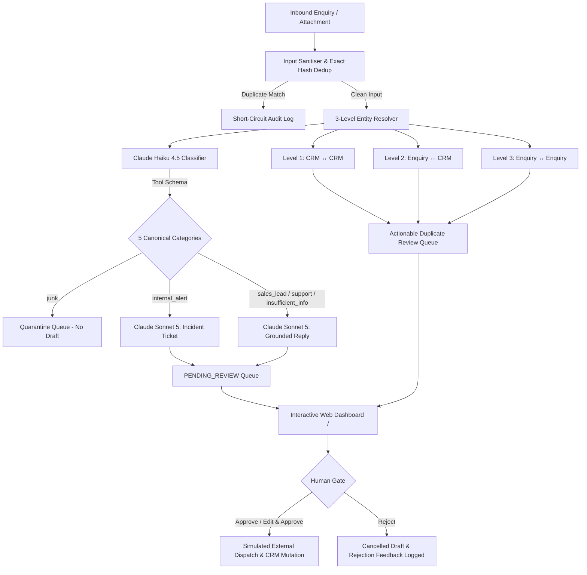

# BEDA Automated Business Enquiry Handling System

> **A defensive, auditable, and human-gated AI pipeline for commercial enquiry classification, entity resolution, and grounded response drafting.** Built with FastAPI, SQLite, and Anthropic Claude (`claude-haiku-4-5-20251001` & `claude-sonnet-5`).

---

## 1. System Overview

BEDA receives diverse inbound communications across email, web forms, and internal system alerts. These inputs vary from high-value commercial solar and battery prospects with attached utility bills, to invoice reconciliation queries, malformed CRM records, and unsolicited marketing spam.

Deploying autonomous AI agents to send emails or mutate customer records directly poses unacceptable commercial, legal, and operational risks. The **BEDA Automated Business Enquiry Handling System** solves this by enforcing:

1. **Defensive Ingestion & Sanitisation:** Defuses prompt-injection directives and sanitizes both email bodies and text attachments.
2. **Defensive CRM Seeding:** Realigns malformed CRM data (e.g. row C002 missing the phone column) via closed-set enum validation.
3. **3-Level Entity Resolution:** Identifies CRM-internal duplicates (Level 1: C001 vs C002), Enquiry-to-CRM matches (Level 2: E001/E002), and sequential enquiry contact corrections (Level 3: E009 to E010). Surfaces unverified contact claims for human review without silently mutating trusted data.
4. **Preservation of Uncertainty:** Routes enquiries to single staff owners, multi-candidate owners (`[Ties Rahardjo, Matt Cooper]` for E008), or zero-candidate owners (`[]` for E006) with `needs_confirmation: true`, refusing to guess unrepresented domains.
5. **Dual-Model LLM Pipeline:** Claude Haiku 4.5 performs schema-enforced classification and structured extraction; Claude Sonnet 5 generates grounded customer replies quoting bill/PO figures or creates Internal Incident Tickets for system failures (E011).
6. **Inviolable Human Review Gate:** Zero outbound messages are dispatched and zero CRM mutations are applied without explicit human approval via an interactive Jinja2 Web Dashboard.
7. **Immutable Audit Trail:** Every pipeline decision appends a strict 7-field audit record (`timestamp`, `input_id`, `step`, `output`, `model_used`, `reasoning`, `status`).

---

## 2. Architecture & Data Flow



### The 5 Canonical Categories & Routing Rules

| Category | Typical Inbound Scope | Default Candidate Owner | Example Case |
| :--- | :--- | :--- | :--- |
| `sales_lead` | High-value commercial solar, battery storage, energy efficiency | **Matt Cooper** (by elimination) | E001, E002, E009, E010 |
| `support` | Existing client queries, invoice disputes, partner installer logistics | **Ties Rahardjo** (admin/ops) or Multi/Zero-candidate | E003 (Ties), E006 (Zero), E008 (Ties/Matt) |
| `insufficient_info`| Commercial prospects missing essential data (schedules, landlord consent) | **Matt Cooper** | E005 (fittings schedule), E012 (landlord consent) |
| `internal_alert` | Infrastructure failures, token expirations, sync job errors | **Ali Pratama** (CRM & Workflows) | E011 (HubSpot OAuth failure) |
| `junk` | Off-topic internship applications, unsolicited marketing spam | *Quarantined* (`assigned_owner: []`) | E004 (crypto leads), E007 (internship application) |

---

## 3. Quickstart & Setup

### Prerequisites
- Python 3.10+
- SQLite 3 (included with Python)

### 1. Installation
Clone the repository and install required dependencies:
```bash
git clone <repo-url>
cd wearebeda
pip install -r requirements.txt
```

### 2. Environment Configuration (Optional)
Create a `.env` file in the root directory (or inside `app/.env`) if you wish to run live LLM calls:
```env
GEMINI_API_KEY=your_google_gemini_api_key_here
```
> *Note: By default, the automated test suite and standard CLI runner support fast, deterministic fixtures (`app/fixtures.py`) that run offline with zero token cost, zero rate limits, and zero non-determinism via the `--fixtures` flag.*

### 3. Initialize & Process via CLI
```bash
# Reset database cleanly and defensively seed from data/data.md
python main.py reset

# Process all 12 cases in batch with Live Gemini 3.8 Flash (requires GEMINI_API_KEY)
python main.py process --all

# Or run with deterministic test fixtures (offline / CI mode)
python main.py process --all --fixtures
```

### 4. Start the Interactive Web Dashboard
```bash
python main.py serve
# Or directly via uvicorn:
uvicorn app.main:app --reload --host 127.0.0.1 --port 8000
```
Open your browser at: **[http://127.0.0.1:8000](http://127.0.0.1:8000)**

Interactive API documentation (Swagger UI) is available at: **[http://127.0.0.1:8000/docs](http://127.0.0.1:8000/docs)**

---

## 4. Testing & Verification

The repository contains 36 comprehensive automated tests covering the entire pipeline:
```bash
pytest
```
*Expected Output:* **35 passed, 1 skipped in ~17s** (1 skipped is the isolated live smoke test when live API keys are not supplied in CI).

### Running the Isolated Live Smoke Test
To test live handshake connectivity against Google Gemini 3.8 Flash endpoints:
```bash
pytest -m live_llm
```

---

## 5. AI Models & Tools Used

1. **Google Gemini 3.8 Flash (`gemini-3.8-flash`)**:
   - **Role:** High-speed, cost-efficient classification, structured entity extraction, and grounded drafting.
   - **Release Date:** September 2, 2026 (Latest state-of-the-art iteration in the Gemini 3 family).
   - **Schema Enforcement:** Employs the official `google-genai` Python SDK (`GenerateContentConfig`) with `response_mime_type="application/json"` and Pydantic `response_schema` to guarantee strict output typing, confidence scores, and uncertainty preservation.
   - **Grounded Drafting:** Generates natural language draft responses and internal incident tickets (E011 for Ali Pratama) strictly constrained by verified numbers and attachment facts.
   - **Context Window:** Up to 1,048,576 tokens (1M tokens) with 64K output capacity.

---

## 6. Known Weaknesses, Limitations & Future Improvements

### Architecture Decision & Limitation: Migration to Gemini 3.8 Flash
- **Context & Limitation:** The original specification referenced Anthropic Claude (Haiku 4.5 & Sonnet 5). Due to external credit balance constraints on third-party Anthropic accounts, the system was migrated to **Google Gemini 3.8 Flash** (`gemini-3.8-flash`) via the official `google-genai` SDK (`v2.14.0`).
- **Benefits:** Unlocks a 1M token context window, native Pydantic JSON schema generation, faster latency, and eliminates third-party credit lockouts.
- **Requirement:** Users running live processing must set `GEMINI_API_KEY` (or `GOOGLE_API_KEY`) in `.env`.

### Known Weaknesses
1. **Live LLM Non-Determinism:** Even with `temperature=0.0`, live LLM responses can exhibit slight syntactic variations across runs. *(Mitigated in CI via the Two-Tier Testing Boundary and deterministic fixtures).*
2. **Single-Process SQLite Locking:** SQLite in standard mode can encounter concurrency lock contention when background threads and web requests perform concurrent writes. *(Mitigated by enabling `WAL` mode and 30-second busy timeouts).*
3. **Regex-Based Attachment Heuristics:** Inbound attachments are normalized as sanitized text. Unstructured PDF/image utility bills currently rely on upstream OCR or plain text conversion.

### What We Would Improve With Another Day
1. **Automated Feedback Learning Loop:** Capture human reviewer edits and rejections into an active evaluation dataset to automatically synthesize few-shot prompt exemplars.
2. **Distributed Asynchronous Worker Queue:** Decouple inbound ingestion and LLM calls into background worker tasks using Redis/Celery or BullMQ with retry exponential backoff and dead-letter queues.
3. **Live Webhook Integrations:** Connect the approved dispatch gate to real external channels (SendGrid/Mailgun for email, and HubSpot/Salesforce bi-directional REST APIs).

---

## 7. Short Screen Recording Guide (Evaluator Walkthrough)

When recording a 2–3 minute demonstration of the system:
1. **CLI Demonstration (30s):**
   - Run `python main.py reset` to show defensive seeding (realigning C002 missing phone).
   - Run `python main.py process --all` to show batch execution, category assignment, and uncertainty flags (e.g. E006 zero-candidate, E008 multi-candidate).
2. **Web Dashboard Overview (30s):**
   - Open `http://127.0.0.1:8000`. Highlight top KPI metrics (Pending Review, Dispatched, Quarantined, Duplicate Reviews).
   - Filter table by `Pending` and `Quarantined`.
3. **Attachment Inspection & Grounded Drafting (45s):**
   - Click **Inspect & Review** on **E001**. Show the attached Truganina energy bill viewer side-by-side with the drafted reply quoting 68,420 kWh and $18,940.
   - Click **Approve & Dispatch**. Show status transitioning to `APPROVED_DISPATCHED`.
   - Inspect **E011**. Show the Internal Incident Ticket directed to Ali Pratama (OAuth expiration + 146 records).
4. **3-Level Entity Resolution (45s):**
   - Scroll to the **Entity Resolution Queue**.
   - Show Level 1 (C001 vs C002): Click **Merge as Duplicate**.
   - Show Level 2 (E002 on C002): Click **Update CRM Field** to apply unverified phone `0400 111 020`.
   - Show Level 3 (E010 on E009): Show Harbour Cold Stores contact correction (Sam's updated phone and email).
