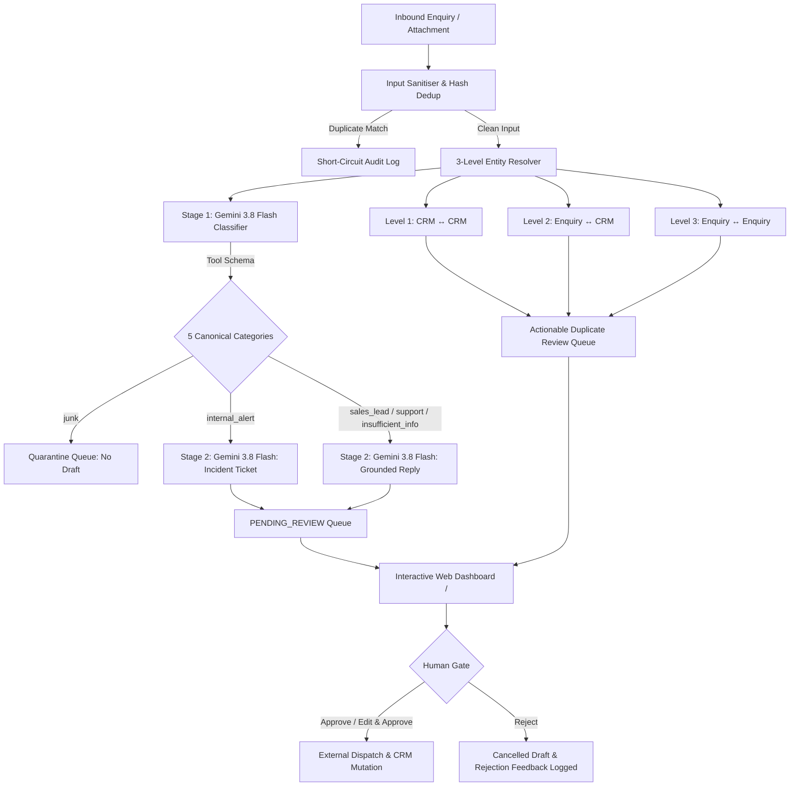

# BEDA: Automated Business Enquiry Handling System

> **A defensive, auditable, and human-gated AI pipeline for commercial enquiry classification, entity resolution, and grounded response drafting.** Built with FastAPI, SQLite, and Google Gemini 3.8 Flash (`gemini-3.8-flash`).

---

## 1. System Overview

BEDA processes diverse inbound communications across email, web forms, and internal system alerts. These inputs range from commercial solar and battery proposals with attached utility bills, to invoice reconciliation queries, malformed CRM records, and unsolicited marketing spam.

Deploying unconstrained autonomous AI agents to send emails or mutate customer records directly poses commercial, legal, and operational risks. The **BEDA Automated Business Enquiry Handling System** mitigates this through:

1. **Defensive Ingestion and Sanitisation:** Defuses prompt-injection attempts and normalizes email bodies and file attachments.
2. **Defensive CRM Seeding:** Realigns malformed CRM data (such as row C002 missing the phone column) using closed-set enum validation.
3. **Three-Level Entity Resolution:** Identifies CRM-internal duplicates (Level 1: C001 vs C002), Enquiry-to-CRM matches (Level 2: E001/E002), and sequential enquiry contact updates (Level 3: E009 to E010). Surfaces unverified contact claims for human review without silently mutating trusted data.
4. **Preservation of Uncertainty:** Routes enquiries to single staff owners, multi-candidate owners (`[Ties Rahardjo, Matt Cooper]` for E008), or zero-candidate owners (`[]` for E006) with `needs_confirmation: true`, refusing to guess unrepresented domains.
5. **Separated Two-Stage AI Processing:** Allows operators to run classification and response drafting separately or as an end-to-end pipeline.
6. **Inviolable Human Review Gate:** Zero outbound messages are dispatched and zero CRM mutations are applied without explicit human approval via the interactive Web Dashboard.
7. **CRM Directory and Side-by-Side Comparison:** Interactive directory for inspecting master CRM records and associated cases, alongside side-by-side duplicate comparison modals with clear decision guidance.
8. **Immutable Audit Trail:** Every pipeline decision appends a strict 7-field audit record (`timestamp`, `input_id`, `step`, `output`, `model_used`, `reasoning`, `status`).

---

## 2. Architecture and Data Flow



### The 5 Canonical Categories and Routing Rules

| Category | Typical Inbound Scope | Default Candidate Owner | Example Case |
| :--- | :--- | :--- | :--- |
| `sales_lead` | High-value commercial solar, battery storage, energy efficiency | **Matt Cooper** (by elimination) | E001, E002, E009, E010 |
| `support` | Existing client queries, invoice disputes, partner installer logistics | **Ties Rahardjo** (admin/ops) or Multi/Zero-candidate | E003 (Ties), E006 (Zero), E008 (Ties/Matt) |
| `insufficient_info`| Commercial prospects missing essential data (schedules, landlord consent) | **Matt Cooper** | E005 (fittings schedule), E012 (landlord consent) |
| `internal_alert` | Infrastructure failures, token expirations, sync job errors | **Ali Pratama** (CRM & Workflows) | E011 (HubSpot OAuth failure) |
| `junk` | Off-topic internship applications, unsolicited marketing spam | *Quarantined* (`assigned_owner: []`) | E004 (crypto leads), E007 (internship application) |

---

## 3. Key Dashboard Views and Capabilities

The web dashboard is organized into four purpose-built views with full English antislop localization:

### View 1: Enquiry Queue
- **Granular Pipeline Controls:**
  - `1. Classify All`: Runs intent classification, category assignment, owner routing, and contact claim extraction.
  - `2. Draft Responses`: Generates grounded customer replies or incident tickets for verified cases.
  - `Run Full Pipeline`: Executes classification, entity resolution, and drafting in an integrated sequence.
  - Individual case action buttons for step-by-step evaluation.
- **Review and Outbound Gate:** Side-by-side inspection of inbound messages, attached documents (such as utility bills), AI reasoning, and draft replies with inline editing, quick approval, or structured rejection.

### View 2: Duplicate and Contact Review
- **Decision Guidance Cards:** Explains key operational differences:
  - **Merge Records:** Unifies duplicate entries under a single primary master record without data loss.
  - **Update CRM Record:** Applies new, verified contact claims (phone, email, PIC) from incoming messages into the target CRM record.
  - **Keep Separate:** Discards the duplicate flag, preserving distinct entity identities.
- **Side-by-Side Comparison Modal (`#dupDetailModal`):** Shows source vs target records, AI match level badges (`Level 1`, `Level 2`, `Level 3`), confidence score, and extracted contact claims.

### View 3: CRM Directory
- **Entity Overview:** Metric cards summarizing Total Entities, Customers, Prospects, and Partners.
- **Search and Filter:** Real-time query search (by company, contact, email, phone, or ID) and type filter chips.
- **Profile Modal (`#crmDetailModal`):** Complete CRM attributes alongside all associated inbound enquiries from that account.

### View 4: Audit Logs
- **Immutable Log Explorer:** Real-time table of all pipeline events with status filters and detailed inspection modal (`#logDetailModal`).

---

## 4. Quickstart and Setup

### Prerequisites
- Python 3.10+
- SQLite 3 (included with Python)

### 1. Installation
Clone the repository and install dependencies:
```bash
git clone <repo-url>
cd wearebeda
pip install -r requirements.txt
```

### 2. Environment Configuration (Optional)
Create a `.env` file in the root directory (or inside `app/.env`) if you wish to run live LLM calls:
```env
GEMINI_API_KEY=your_google_gemini_api_key_here
```
> *Note: By default, the automated test suite and standard CLI runner support fast, deterministic fixtures (`app/fixtures.py`) that run offline with zero token cost, zero rate limits, and zero non-determinism via the `--fixtures` flag.*

### 3. Initialize and Process via CLI
```bash
# Reset database cleanly and defensively seed from data/data.md
python main.py reset

# Process all 12 cases in batch with Live Gemini 3.8 Flash (requires GEMINI_API_KEY)
python main.py process --all

# Or run with deterministic test fixtures (offline / CI mode)
python main.py process --all --fixtures
```

### 4. Start the Interactive Web Dashboard
```bash
python main.py serve
# Or directly via uvicorn:
uvicorn app.main:app --reload --host 127.0.0.1 --port 8000
```
Open your browser at: **[http://127.0.0.1:8000](http://127.0.0.1:8000)**

Interactive API documentation (Swagger UI) is available at: **[http://127.0.0.1:8000/docs](http://127.0.0.1:8000/docs)**

---

## 5. Testing and Verification

The repository contains 38 automated unit and integration tests covering the entire pipeline:
```bash
python -m pytest -m "not live_llm"
```
*Expected Output:* **38 passed, 1 deselected in ~17s** (1 deselected is the isolated live smoke test when live API keys are not supplied in CI).

### Running the Isolated Live Smoke Test
To test live handshake connectivity against Google Gemini 3.8 Flash endpoints:
```bash
python -m pytest -m live_llm
```

---

## 6. AI Models and Architecture

### Google Gemini 3.8 Flash (`gemini-3.8-flash`)
- **Role:** High-speed, cost-efficient classification, structured entity extraction, and grounded drafting.
- **Release Date:** September 2, 2026 (Latest iteration in the Gemini family).
- **Schema Enforcement:** Employs the official `google-genai` Python SDK (`GenerateContentConfig`) with `response_mime_type="application/json"` and Pydantic `response_schema` to guarantee strict output typing, confidence scores, and uncertainty preservation.
- **Grounded Drafting:** Generates natural language draft responses and internal incident tickets (E011 for Ali Pratama) strictly constrained by verified numbers and attachment facts.
- **Context Window:** Up to 1,048,576 tokens (1M tokens) with 64K output capacity.

---

## 7. Known Weaknesses and Future Improvements

### Known Weaknesses
1. **Live LLM Non-Determinism:** Even with `temperature=0.0`, live LLM responses can exhibit slight syntactic variations across runs. *(Mitigated in CI via the Two-Tier Testing Boundary and deterministic fixtures).*
2. **Single-Process SQLite Locking:** SQLite in standard mode can encounter concurrency contention when background threads and web requests perform concurrent writes. *(Mitigated by enabling WAL mode and 30-second busy timeouts).*
3. **Plain Text Attachment Normalization:** Inbound attachments are normalized as sanitized text. Unstructured PDF or image bills currently rely on upstream OCR or text extraction.

### Future Roadmap
1. **Automated Feedback Learning Loop:** Capture human reviewer edits and rejections into an active evaluation dataset to continuously refine few-shot exemplars.
2. **Distributed Asynchronous Worker Queue:** Decouple inbound ingestion and LLM calls into background worker tasks using Redis/Celery or BullMQ with exponential backoff and dead-letter queues.
3. **Live Webhook Integrations:** Connect the approved dispatch gate to real external channels (SendGrid/Mailgun for email, and HubSpot/Salesforce bi-directional REST APIs).

---

## 8. Evaluator Demonstration Walkthrough

When recording a 2 to 3 minute demonstration of the system:
1. **CLI Demonstration (30s):**
   - Run `python main.py reset` to show defensive seeding (realigning C002 missing phone).
   - Run `python main.py process --all --fixtures` to show batch execution, category assignment, and uncertainty flags (E006 zero-candidate, E008 multi-candidate).
2. **Web Dashboard Overview (30s):**
   - Open `http://127.0.0.1:8000`. Highlight top KPI metrics (Pending Review, Dispatched, Quarantined, Duplicate Reviews).
   - Filter table by `Needs Review` and `Unprocessed`.
   - Demonstrate the two-stage controls: `1. Classify All` and `2. Draft Responses`.
3. **Attachment Inspection and Grounded Drafting (45s):**
   - Click **Inspect & Dispatch** on **E001**. Show the attached Truganina energy bill viewer side-by-side with the drafted reply quoting 68,420 kWh and $18,940.
   - Click **Approve & Dispatch Response**. Show status transitioning to `APPROVED_DISPATCHED`.
   - Inspect **E011**. Show the Internal Incident Ticket directed to Ali Pratama (OAuth expiration + 146 records).
4. **Duplicate Review and CRM Directory (45s):**
   - Switch to **Duplicate & Contact Review**.
   - Review the Decision Guidelines explaining `Merge Records` vs `Update CRM Record` vs `Keep Separate`.
   - Open **Compare Details** on Level 1 (C001 vs C002) and click **Merge Records**.
   - Switch to **CRM Directory**. Show real-time search, filter chips, and open a profile modal inspecting company details and linked enquiry history.
